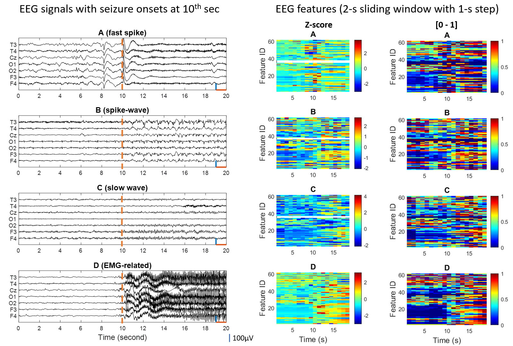

# EEG feature engineering for epileptic seizure detection

This repo records the the MATLAB codes for the most challenging part, EEG feature engineering, for the epileptic seizure-detection task. These EEG features have been used by the published papers in Citation.

**EEG feature domains**  
| Feature No.   | Feature domains                                  | Description           |
| :----:| :----:                                   | :----:          |
| 1-4   | basic statistics    | mean amptitude, std amptitude, zero-cross times, range of amptitude|
| 5-16   | spectral analysis   | power ratio and absolute power of each freq bands, alpha, beta, theta, delta, gamma, and freq centroid, total power |
| 17-28   | time-freq domain | mean and std of coefficients of discrete wavelet transform(DWT) on six freq bands|
| 29-31   | nonlinear features  | ApEn, L-Z complexity, Hurst exponential|
| 32-43   | spatio-temporal domain   | phase lock values on six freq bands and brain areas|
| 44-47   | synchronization measure (with fime/freq shift)   | dynamic warpping in the time and freq domains|
| 48-62   | complex-network features   | features extracted from the time & freq -invariant networks |

Feature 1-47 refer to [paper](https://www.sciencedirect.com/science/article/abs/pii/S1746809417300344); feature 48-62 fefer to [paper](https://www.sciencedirect.com/science/article/abs/pii/S0165027017302510).


**EEG feature extraction**  
First, download this repo by:
```
git clone git@github.com:ieeeWang/EEG-feature-seizure-detection.git
```
Second, run 'FeatureExtractDemo.m', which performs feature enginnering on 4 types of seizure EEG segments.
Then, plot the EEG segments and EEG features by using 'plot-SEZseg.m' and 'plot_Fv'.    
Finally, the EEG feature mapping from EEG signals will looks as below.
<div>
    <div style="text-align:center">
    
</div>


**Citation**    
If you find this repository helpful, please cite our work:  
```
@article{wang2017seizure,
  title={Seizure pattern-specific epileptic epoch detection in patients with intellectual disability},
  author={Wang, Lei and Arends, Johan BAM and Long, Xi and Cluitmans, Pierre JM and van Dijk, Johannes P},
  journal={Biomedical Signal Processing and Control},
  volume={35},
  pages={38--49},
  year={2017},
  publisher={Elsevier}
}
@article{wang2017eeg,
  title={EEG analysis of seizure patterns using visibility graphs for detection of generalized seizures},
  author={Wang, Lei and Long, Xi and Arends, Johan BAM and Aarts, Ronald M},
  journal={Journal of neuroscience methods},
  volume={290},
  pages={85--94},
  year={2017},
  publisher={Elsevier}
}
@article{wang2019broadband,
  title={A broadband method of quantifying phase synchronization for discriminating seizure EEG signals},
  author={Wang, Lei and Long, Xi and Aarts, Ronald M and van Dijk, Johannes P and Arends, Johan BAM},
  journal={Biomedical Signal Processing and Control},
  volume={52},
  pages={371--383},
  year={2019},
  publisher={Elsevier}
}
@article{wang2019eeg,
  title={EEG-based seizure detection in patients with intellectual disability: Which EEG and clinical factors are important?},
  author={Wang, Lei and Long, Xi and Aarts, Ronald M and van Dijk, Johannes P and Arends, Johan BAM},
  journal={Biomedical Signal Processing and Control},
  volume={49},
  pages={404--418},
  year={2019},
  publisher={Elsevier}
}
```

